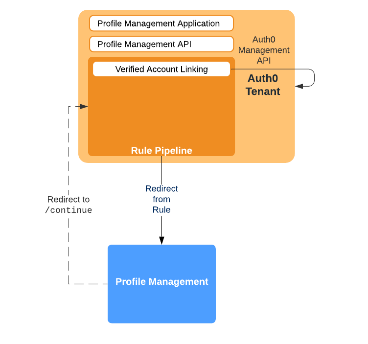

# Profile Management

This section of the repository contains reference implementation for the Profile Management functionality to be implemented external to Auth0. You can use it as-is, or incorporate as part of your own/existing functionality in order to support Verfiried Account Linking in Auth0. The diagram below illustrates the architecture associated with the implementation provided. As can be seen, there is a Profile Management application which is used in conjunction with the corresponding Auth0 [Tenant assests](../Tenant). **Note: all implementation provided has been built and tested using [Node.js](https://nodejs.org/en/) version 12.18**

## Client

The [`client`](client) folder contains reference [Node.js](https://nodejs.org/en/) implementation for the interactive Profile Management single page client application, which provides the User Interface Experience (UI/UX) as part of Verified Account Linking [Redirect](https://docs.google.com/document/d/149DypzRAUDK4ag4wzYBbL0_PwF9INcMkIBbfHkyKZNQ/edit#bookmark=kix.bdqv3ulhlrnn) processing. For further details please refer to the [readme](Client) contained in the folder.

## Issue Reporting

If you have found a bug or if you have a feature request, please report them via the issues section of this repository. Please do not report security vulnerabilities on the public GitHub issue tracker. The [Responsible Disclosure Program](https://auth0.com/whitehat) details the procedure for disclosing security issues.

## License

This project is licensed under an MIT LICENSE. Please see the [LICENSE](../LICENSE) file for more info.
